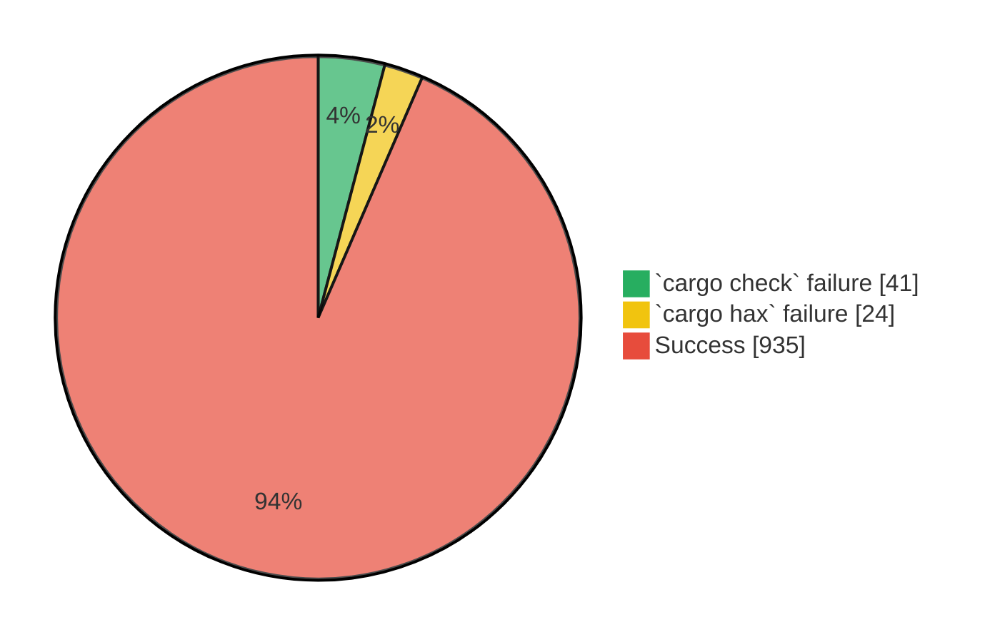
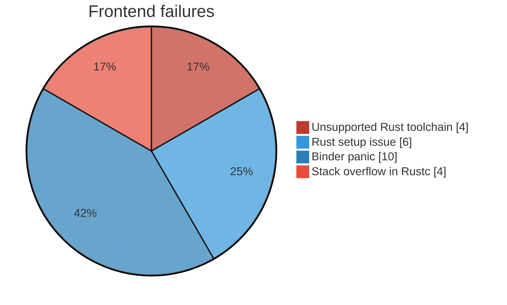

# Evaluation of the hax Frontend

This section provides an evaluation of the hax frontend, consisting of two parts:

- A **quantitative evaluation**, which measures how effectively the frontend processes Rust code.
- A **qualitative analysis**, which explores the frontend’s capabilities in real-world scenarios.

Together, these evaluations document the current strengths and limitations of the hax frontend.

## Quantitative Evaluation

The quantitative evaluation aims to estimate how much Rust code the frontend can handle. It does **not** assess the correctness of the frontend's output.

### Overview

The hax toolchain is composed of several components (see [high-level architecture](./index.md#high-level-arch)):

- **Frontend**: hooks into the Rust compiler to export rich Abstract Syntax Trees (ASTs) for specified crates.
- **Engine** and **Backends**: consume those ASTs to produce code.
- **Libraries**: `hax-lib` provides supporting functionality, and reference models for existing Rust libraries (e.g. the [Core library](https://doc.rust-lang.org/stable/core/) of Rust).

In this quantitative evaluation, we focus on the **frontend**: the process of generating JSON-encoded ASTs from Rust code. We aim to assess:

1. **Successful Extraction**: The success rate of producing ASTs.
2. **Performance**: Ensuring the extraction process remains efficient enough for real-world usage.

### Methodology

For each Rust crate in our test set, we follow these steps:

1. Clone the crate's source code.
2. Run `cargo fetch` to download its dependencies.
3. Execute `cargo hax json --use-ids`, recording any errors and the time taken.
4. Clean Cargo's cache with `cargo clean`.
5. Run `cargo check`, again recording any errors and time. Since `cargo hax json` is effectively `cargo check` with extra work, this serves as our performance baseline.

We implemented this protocol in an internal Cryspen tool, which also evaluates other parts of the hax toolchain.

### Crate Selection

To ensure we capture a diverse set of crates:

- We include the **5,000 most downloaded** crates from crates.io.
- We also include the **top 1,500 crates** in the **cryptography** category on crates.io, reflecting hax's relevance for verifying critical software like cryptographic libraries.

> **TODO:** the numbers are wrong: I want to get more numbers. Currently we have top 1000k crates only. This is because the tool ran for 10 hours, and handled only 1k crates. The top 1k crates in the corpus `5k top crate \union top 1k5 crypto crates` is actually top 1k crates. (that makes sense)

### Success Rate

Each crate falls into one of three categories:

1. **Successful**: hax produced a valid AST.
2. **Failed**: hax could not produce an AST (despite `cargo check` succeeding).
3. **Both Failed**: Both `cargo check` and `cargo hax` failed.

Out of 1000 crates, our tool failed to run `cargo check` on 41 of them due to
setup issues. These problems typically involve missing system packages that
Cargo cannot automatically install or unusual Cargo configurations that require
manual intervention. We therefore exclude these 41 crates from further analysis.

Of the remaining 959 crates, the hax frontend successfully processed a **vast
majority (97.5%)**. The remaining failures fall into four distinct categories,
as illustrated in the pie chart below.

The errors marked in **blue** on the chart indicate situations where the Rust
toolchain used by the tested crate or its dependencies is incompatible with the
specific version hax is pinned to, or where the crate and hax are sensitive to
toolchain variations. Rust edition 2024 was updated very recently, which
explains roughly half of these issues.

The errors shown in **red**, however, are directly related to hax. The
binder-related panics are a [known
bug](https://github.com/cryspen/hax/issues/1046). Additionally, the stack
overflow errors occur due to specific code paths in the Rust compiler being
incorrectly triggered by hax. Ultimately, only **1.6%** of crates encounter such
hax-specific bugs.

### Performance Analysis

For the crates that successfully generated ASTs, we compared the time taken by `cargo hax json` against `cargo check`. Because crate size and complexity vary greatly, we normalized[^1] the times to allow fair comparisons.

| Statistic       | Cargo Check | Cargo Hax |
|-----------------|------------:|----------:|
| **Median**      |       0.147 |     0.780 |
| **Mean**        |       0.215 |     0.771 |
| **10th Decile** |       0.425 |     0.953 |

<!-- We break down the results into **cryptography crates** and **general crates**: -->

<!-- #### Cryptography Crates

| Statistic       | Cargo Check | Cargo Hax |
|-----------------|------------:|----------:|
| **Median**      |       0.148 |     0.796 |
| **Mean**        |       0.199 |     0.777 |
| **10th Decile** |       0.411 |     0.948 | -->

- On average, `cargo hax` is about 4–5 times slower than `cargo check`.
- At the **10th decile**, the slowdown is only about 2×, indicating better scaling for larger crates.

### Conclusion

Our quantitative evaluation shows that the hax frontend successfully extracts ASTs for a large portion of the Rust ecosystem. Nevertheless, a small portion of crates reveal performance bottlenecks or outright failures that require further investigation and optimization.

These results also highlight a few **limitations** of this initial study:

- We only evaluated the **frontend** process. Other stages of the toolchain, such as the engine, backends or libraries, require separate assessments.
- We did not assess the **correctness or completeness** of the generated JSON, highlighting the need for a qualitative analysis to verify that the extracted ASTs meet the required specifications.

Overall, the hax frontend demonstrates capabilities for large-scale Rust code verification, but continued refinement is needed to handle edge cases and improve performance.

[^1]: For a given crate, we normalize the times by dividing them by the total time.

## Qualitative evaluation

The qualitative evaluation aims at identifying what Rust patterns the frontend can handle. It also tests whether the information extracted from the frontend describes correctly the input Rust code.

### Rustc coverage test suite

The Rust compiler (rustc) has extensive test suites that describe various expectations of how it should handle Rust input. One of them is the [coverage test suite](https://rustc-dev-guide.rust-lang.org/tests/compiletest.html#coverage-tests) which contains a set of Rust inputs that is supposed to cover a wide range of Rust constructs. This test suite has been adapted to test hax.

We use the following methodology:
- The Rust inputs from the test suite have been copied to `rustc-coverage-tests/src/`, and can be updated using a script.
- A Rust crate structure is built around these source files, to allow hax to handle them. The files that fail `cargo check` are excluded. There are currently 26 excluded (out of 81) tests, mostly because they contain asynchronous code, which requires a runtime file that is missing in our infrastructure.
- To test hax frontend, we run `cargo hax json`. If the command succeeds, the test is considered successful.

These tests aim at increasing the confidence in the ability of hax frontend to handle Rust inputs covering all of the language constructs. As of today, all tests are handled successfully by hax frontend. However we don't test any requirement on the output (see the following section for tests of hax frontend output quality).

### Rust printer testing

This method aims at testing the quality of hax frontend's output. It uses the Rust hax engine.

This tool (written in Rust) takes the output of hax frontend (a json file describing the content of a Rust crate), it imports it as an AST (similar to the hax engine AST), and then prints this AST in Rust syntax. 

If the Rust code we get out of this tool is equivalent to the Rust code it was given as input, then this means hax frontend correctly extracted the input code without losing or altering any information.

There is no easy way of testing the full input/output equivalence so the methodology here is to test that the resulting code behaves the same as the input code with respect to relevant test cases.

This work is available in the `hax-rust-engine` folder. In the `tests` subfolder, an input file is available with tests for all Rust constructs supported by the printer (currently functions and expressions). For now these tests pass after extracting and printing the file with hax frontend and the Rust printer. This means that for the Rust constructs covered by the printer and the test file, hax frontend's extraction is correct. However this still needs to be extended to test more Rust constructs.
