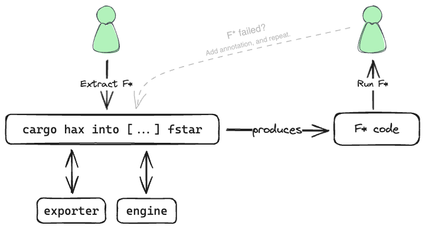
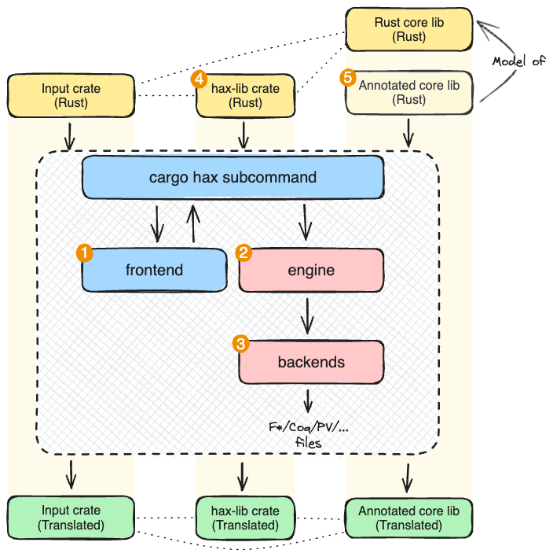
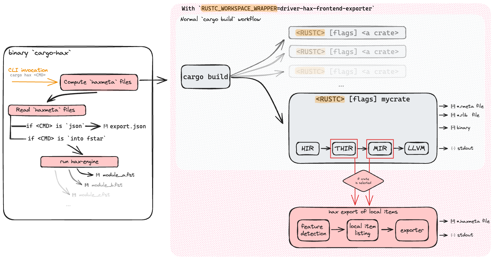
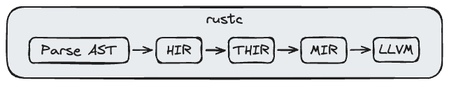

# Frontend

hax is a tool designed to facilitate the formal verification of Rust programs. It enables the translation of Rust crates into formal languages like F* or Coq. Once translated, these formal representations allow to write formal proofs about the behavior and correctness of their Rust code.

## User flow

This document focuses on a specific user flow: extracting F\* code. The process
described here applies similarly to all other backends, including F*, Rocq,
SSProve, ProVerif, and EasyCrypt.

The goal is for the user to prove a property on a Rust function, `f`, using the F\* formal language. The function `f` is defined in the module `mymod`, within the crate `mycrate`.

To achieve this, the user follows these steps:

 1. Annotate the Rust crate mycrate with the properties to be proven and, if needed, provide proof hints.
 2. Run the command `cargo hax into -i '-** +mycrate::mymod::f' fstar`.
 3. Execute F\*. If F\* fails to prove the specified properties, the user revisits step (1) to refine the annotations and proof hints.

For a practical guide on using Hax, please refer to the [manual](../manual/index.md).

## High-Level Architecture of Hax {#high-level-arch}

Hax consists of five main components, as illustrated in the diagram below, with
each numbered step directly corresponding to its labeled section in the diagram:

1. The **frontend** handles the extraction and export of given [Rust
   crates](https://doc.rust-lang.org/book/ch07-01-packages-and-crates.html) into
   abstract syntax trees (ASTs).
2. The **engine** performs a series of phases and rewrites, simplifying and
   transforming the Rust program as needed.
3. The **backends** --one per target language-- request the engine to simplify
   the Rust program for their specific target and then pretty-print the program
   as F*, Roq, PV, or other formats.
4. The Rust helper crate, **hax-lib**, provides Hax-specific helpers and macros
   to annotate a Rust program with properties, invariants, or proof hints.
5. The **annotated standard library** is a work in progress partial model for the
   Rust base libraries (`core`, `std`, `alloc`), enriched with logical
   properties to assist in formal verification.

{:.center}

In the diagram, the dotted lines indicate dependencies between Rust or F\*
artifacts, flowing from left to right.

The user begins by exporting a crate (referred to as the "Input crate" in the
top left of the diagram). This crate depends on both the Rust `std` library and
`hax-lib`. The `std` dependency is added automatically by Rust, while the
`hax-lib` dependency is introduced by hax.

The input crate passes through the hax toolchain as follows:
- First, the crate is parsed and exported as JSON by the **frontend** (➊), with
  assistance from the Rust compiler.
- Next, the **engine** processes the exported data (➋), transforming and
  simplifying it.  
- Finally, the **F\*** backend generates the corresponding F\* files (➌).

Since the input crate depends on both `std` and `hax-lib`, the generated F\*
modules maintain these dependencies. To handle this, Hax translates `hax-lib` to
F\* (➍) and also translates our model of the `std` library (➎) into F\*.

## Ast Extraction Workflow

This section delves into the technical details of hax's extraction process. The
process involves the following components (as illustrated in the diagram below,
with each numbered step directly corresponding to its labeled section in the
diagram):

1. **`cargo-hax`**: a binary that provides a [custom
   command](https://doc.rust-lang.org/book/ch14-05-extending-cargo.html) `hax`
   to `cargo`.
2. **`cargo check`**: the `check` subcommand of `cargo`. It is sensitive to the
   environment variable `RUSTC_WORKSPACE_WRAPPER`: when set, `cargo` will call
   the program specified by `$RUSTC_WORKSPACE_WRAPPER` instead of `rustc`.
3. **`driver-hax-frontend-exporter`**: a [custom `rustc`
   driver](https://jyn.dev/rustc-driver/#paths). Instead of compiling Rust into
   a binary, `driver-hax-frontend-exporter` exports ASTs as JSON.
4. **`hax-frontend-exporter`**: a library that mirrors Rust's internal ASTs as
   its own enriched AST representation. This library also provides bridges from
   Rust's ASTs to its enriched ASTs.

When `cargo check` compiles a crate, it invokes `rustc` multiple times, but only
some of these calls are relevant to us. Additionally, `cargo check` may also
build dependencies. As a result, we inject our custom export logic selectively,
ensuring that `driver-hax-frontend-exporter` behaves exactly like `rustc` in
all other cases.

During compilation, `rustc` produces several artifacts:

- **`*.rmeta` files**: metadata files containing type information, function
  signatures, constants, and more.
- **`*.rlib` files**: static library artifacts with compiled Rust code and
  metadata.
- **Diagnostic messages**: messages on standard output for communication with
  `cargo check`, including errors, warnings, and status updates.

Our custom export logic extends this by generating additional artifacts:

- **`*.haxmeta` files**: similar to Rust's `*.rmeta` files, but contains full
  enriched abstract syntax trees. The `haxmeta` files contains a binary
  serialization of the
  [`HaxMeta`](https://hax.cryspen.com/frontend/docs/hax_types/driver_api/struct.HaxMeta.html)
  type.
- **Diagnostic messages**: sent to standard output and used to communicate
  specifically with `cargo hax`. Those messages are JSON serializations of the
  [`HaxDriverMessage`](https://hax.cryspen.com/frontend/docs/hax_types/driver_api/enum.HaxDriverMessage.html)
  type.

After calling `cargo check`, `cargo hax` parses the `*.haxmeta` files and
continues further along the hax toolchain, either by outputting JSON directly or
by calling the engine to generate files for targets such as F\*, ProVerif, or
Roqc.

`cargo-hax`, `driver-hax-frontend-exporter`, and `hax-frontend-exporter`
together form what we refer to as "the frontend". The engine is represented by
the binary `hax-engine`, which includes the backends. The frontend is
implemented in Rust, while the engine is implemented in OCaml. Communication
between all components occurs through **stdout**, **stderr**, or **stdin**,
using JSON messages defined in the Rust crate
[`hax-types`](https://hax.cryspen.com/frontend/docs/hax_types/index.html).

This section provides an overview of the workflow of the frontend of hax. The
section TODO dives into the inner functioning of the components of the frontend.

<!-- 
## A Brief Tour of The Rust Compiler

The Rust compiler transforms raw source code from the user into various representations, all the way to machine code when that's what the user requests.

The Rust compiler has several intermediate representations (IR), exposing various views on Rust programs, each suited for different jobs: parsing, typing, borrow checking, etc. As illustrated below by the diagram, the following main IR are:

  - **Parse AST**: an untyped abstract syntax tree (AST) just after parsing;
  - **HIR**: Higher-level Intermediate Representation, an AST close to Rust surface language after name resolution and macro expansion;
  - **THIR**: Typed Higher-level Intermediate Representation, a fully typed version of HIR;
  - **MIR**: Mid-level Intermediate Representation, a simplified Rust AST, in which borrow checking takes place;
  - **LLVM**: interfaces with LLVM.

{: .center style="width:min(100%, 500px)"}

## Querying The Rust Compiler

The Rust compiler has mechanisms enabling tools to hook into it at the various compile stages. From here, it is possible to interactively ask Rust about items such as types, traits, names, etc. of a certain Rust construct inside the code.

The Rust compiler is optmizied for performance; its work is divided in many
smaller parts and is orchestrated by a system of lazy queries.

Rust is optmizied for performance, and its query system is a complex beast.
Finding your way to the information you are looking for is not simple and
requires a certain familiarity with the compiler.

From this observation, we decided to split hax in two: a first part that interacts with rustc, and a second that transform Rust ASTs to our various backends.

The goal of the frontend is to take care of all the boring and complex job of interacting with rustc.
The frontend takes Rust code and extracts complete ASTs, designed for easy consumption for other tools.

The ASTs we define are mirrored version of rustc's THIR and MIR, enriched with a lot of extra pieces of data.

## Workflow of the JSON extraction

The frontend defines a binary `cargo-hax`, providing a [custom command](https://doc.rust-lang.org/book/ch14-05-extending-cargo.html) `hax` to `cargo` that allows you to get a JSON-encoded AST for a given Rust program.

Running `cargo hax json` invokes hax' frontend and queries for JSON.

The motivation behind hax' frontend is that interacting with the Rust compiler (rustc) can be difficult. Rustc works with its internal optimized representations and with a system of interactive queries.

The hax frontend. Its [rustdoc](https://doc.rust-lang.org/rustdoc/what-is-rustdoc.html) documentation can be found [here](./docs/hax_frontend_exporter/index.html). -->
